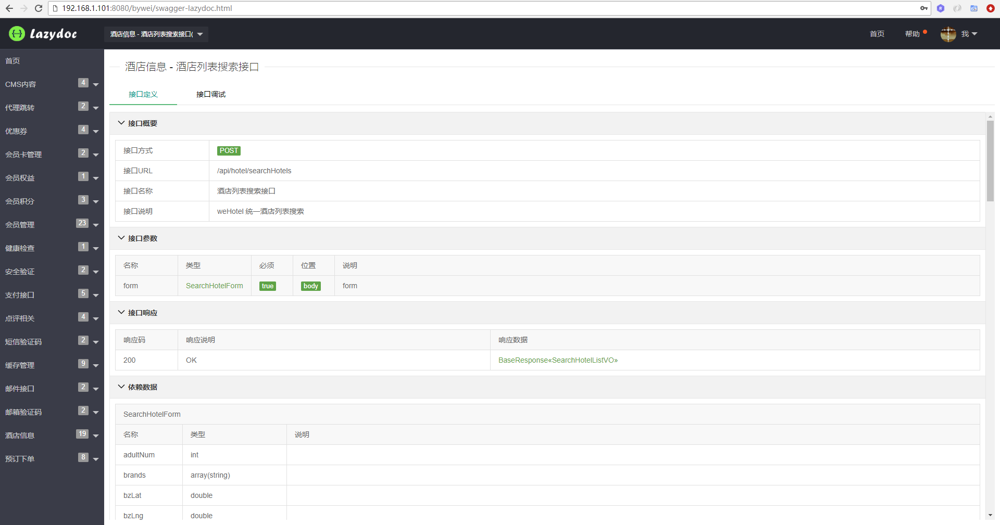
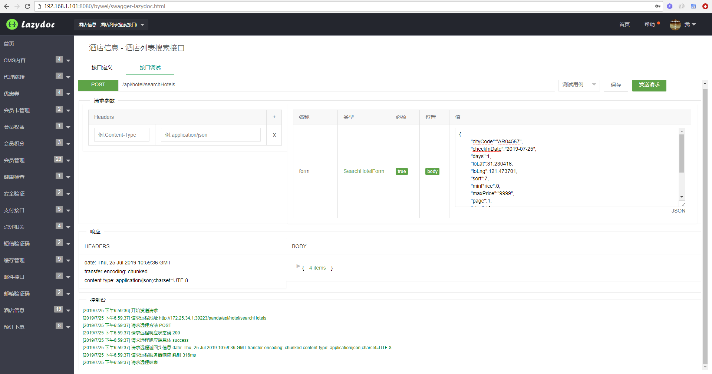

# SwaggerLazydoc
Swagger Lazydoc Source Code




## 安装
```
<dependency> 
 <groupid>cn.bywei</groupid> 
 <artifactid>swagger-lazydoc-ui</artifactid>
 <version>1.0.2</version> 
</dependency>
```

## 配置
```
#swagger lazydoc config
#配置是否启用 swagger lazydoc 生成文档
swagger.lazydoc.enable=true
#配置生成的 swagger lazydoc 文档版本
swagger.lazydoc.version=2.0
#文档展示标题
swagger.lazydoc.title=swagger lazydoc apis
#文档展示描述信息
swagger.lazydoc.description=swagger lazydoc Project!
#文档联系人
swagger.lazydoc.contact.name=ByWei.Cn
#文档联系网址
swagger.lazydoc.contact.url=http://swagger-lazydoc.bywei.cn
#文档联系邮箱
swagger.lazydoc.contact.mail=master@bywei.cn
#生成文档包路径
swagger.lazydoc.basePackage=cn.bywei.api.controller
#是否启用权限验证,为 true 则必须验证后登录,并配置本地权限验证用户名密码
swagger.lazydoc.auth=true
#开启本地权限验证 swagger.lazydoc.auth=true 后,登录用户名
swagger.lazydoc.username=lazydocuser
#开启本地权限验证 swagger.lazydoc.auth=true 后,登录密码
swagger.lazydoc.password=lazydocpwd123
#配置云服务地址(非必须)，可下载开源代码自定义部署
swagger.lazydoc.cloudUrl=http://swagger-lazydoc.bywei.cn/cloud
```

## 官方
[SwaggerLazydoc博客](http://www.bywei.cn/tag/api%E6%8E%A5%E5%8F%A3) http://www.bywei.cn/tag/api%E6%8E%A5%E5%8F%A3


## 待实现功能列表
* 支持 API 测试用例 Mock 功能
* 云服务端支持多用户
* 云服务端支持开放 API 管理
* 支持导出 swagger PDF 或者 HTML 文档

## swagger-lazydoc v1.0.2
* 测试用例响应 JSON 字符串超长自动换行
* 增加本地权限控制
* 增加云登录权限控制
* 增加云服务端管理
* 增加测试用例保存功能

## swagger-lazydoc v1.0.0
* 项目初始化构想设计
* 优化文档管理界面风格
* 测试用例页面增加格式化响应报文
* 测试用例页面增加响应头信息
